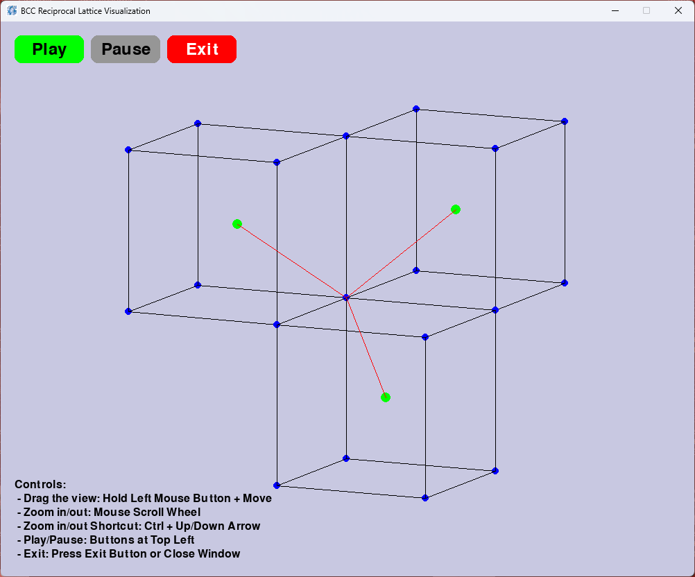

# BCC Reciprocal Lattice Visualizer

A 3D interactive visualization of a Body-Centered Cubic (BCC) lattice and its geometric reciprocal structure, built with Python and Pygame.

This is a revised version of an original assignment project. The original single-file version is kept in `legacy/` for comparison.



---

## What it shows

Three BCC unit cells sharing a common corner, with lines drawn from each cube's center to that shared intersection point — representing the reciprocal lattice geometry. The structure rotates automatically and can be manipulated interactively.

> Note: this is a manually constructed geometric model, not a computed reciprocal lattice derived from physical lattice vectors. It's intended for visual and educational purposes.

> Which for that reason, I'm also planning on polishing it further to more applicable educational purpose where it applies real physical interpretation from actual theoritical framework. But that's for another story.

---

## Controls

| Action | Input |
|---|---|
| Rotate | Hold left mouse button + drag |
| Zoom | Scroll wheel or Ctrl + Up/Down |
| Play / Pause rotation | Buttons at top left |
| Exit | Exit button or close window |

---

## Running from source

**Requirements**
- Python 3.10+
- Dependencies listed in `requirements.txt`

**Setup**

```bash
git clone https://github.com/yourusername/bcc-visualizer
cd bcc-visualizer
pip install -r requirements.txt
python main.py
```

**Configuration**

Edit `config.json` to adjust window size, initial zoom, and starting rotation angles before launching.

```json
{
  "window_width": 1000,
  "window_height": 800,
  "initial_zoom": 100,
  "initial_rotation_x": 0,
  "initial_rotation_y": 0
}
```

---

## Project structure

```
├── main.py          # entry point and main loop
├── config.py        # configuration loading and color constants
├── lattice.py       # BCC geometry: points, edges, centers
├── renderer.py      # projection, rotation, and drawing functions
├── ui.py            # event handling and button layout
├── config.json      # user-adjustable settings
├── notes/           # personal notes from the refactor process
└── legacy/          # original single-file version
```

---

## Known issues

- The center intersection point may drift slightly after repeated zooming. This is a rounding accumulation issue in the zoom calculation and doesn't significantly affect usability.

---

## Built with

- [Pygame](https://www.pygame.org/) 2.6.1
- [NumPy](https://numpy.org/) 2.4.2

## Credits
App icon (BCC.png) from Callister & Rethwisch 5e @ [Fundamentals of Materials Science and Engineering](https://ftp.idu.ac.id/wp-content/uploads/ebook/tdg/TEKNOLOGI%20REKAYASA%20MATERIAL%20PERTAHANAN/Fundamentals%20of%20Materials%20Science%20and%20Engineering%20An%20Integrated%20Approach%20by%20William%20D.%20Callister,%20David%20G.%20Rethwisch%20(z-lib.org).pdf)
